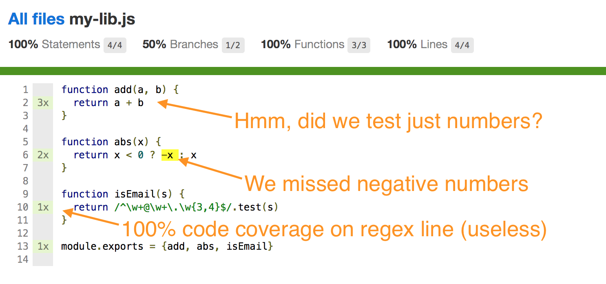
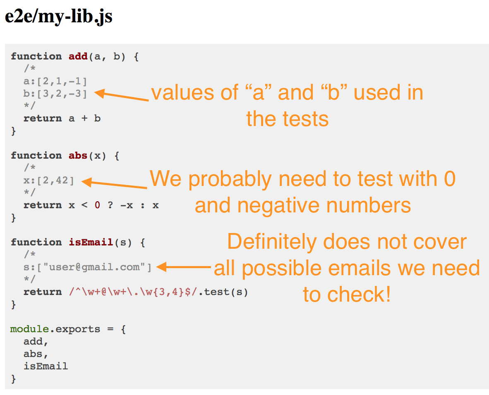

# data-cover

> Instruments code for collecting data coverage (instead of code coverage)

**Really experimental, do not use yet!**

[![NPM][data-cover-icon]][data-cover-url]

[![Build status][data-cover-ci-image]][data-cover-ci-url]
[![semantic-release][semantic-image] ][semantic-url]

## What?

This module can instrument and collect *data coverage* for functions. Instead of measuring
which code lines were executed by the unit tests, it collects the arguments to each function.

## Why?

Imagine a function checking if a given string is an email address.

```js
function isEmail(s) {
  return /^\w+@\w+\.\w{3,4}$/.test(s)
}
```

It looks reasonable and it is simple to test getting 100% code coverage. Something like this
would work

```js
it('passes gmail emails', () => {
  console.assert(isEmail('user@gmail.com'))
})
```

Yet, the 100% code coverage, collected using a tool like 
[nyc / istanbul](https://github.com/istanbuljs/nyc#readme) tells us nothing. It is much better
to collect *all strings passed to isEmail during all unit tests*. In this case, `data-cover`
reports that we only used a single email!

```js
function isEmail(s) {
  /*
  s:["user@gmail.com"]
  */
  return /^\w+@\w+\.\w{3,4}$/.test(s)
}
```

This makes it very simple to figure out what other classes of inputs should be given by the
unit tests to cover all possible cases: for example emails with 2 letter TLD like `user@gmail.ru`,
or emails with dots and dashes like `user.name@gmail.com`.

## Screenshots

Typical code coverage collected by `nyc`



Same unit tests running through `data-cover`



## Use

Install and preload `data-cover` when running your unit tests, for example when using Mocha

```sh
mocha -r data-cover spec.js
```

**Still work in progress**

### Small print

Author: Gleb Bahmutov &copy; 2017

* [@bahmutov](https://twitter.com/bahmutov)
* [glebbahmutov.com](https://glebbahmutov.com)
* [blog](https://glebbahmutov.com/blog)

License: MIT - do anything with the code, but don't blame me if it does not work.

Spread the word: tweet, star on github, etc.

Support: if you find any problems with this module, email / tweet /
[open issue](https://github.com/bahmutov/data-cover/issues) on Github

## MIT License

Copyright (c) 2017 Gleb Bahmutov

Permission is hereby granted, free of charge, to any person
obtaining a copy of this software and associated documentation
files (the "Software"), to deal in the Software without
restriction, including without limitation the rights to use,
copy, modify, merge, publish, distribute, sublicense, and/or sell
copies of the Software, and to permit persons to whom the
Software is furnished to do so, subject to the following
conditions:

The above copyright notice and this permission notice shall be
included in all copies or substantial portions of the Software.

THE SOFTWARE IS PROVIDED "AS IS", WITHOUT WARRANTY OF ANY KIND,
EXPRESS OR IMPLIED, INCLUDING BUT NOT LIMITED TO THE WARRANTIES
OF MERCHANTABILITY, FITNESS FOR A PARTICULAR PURPOSE AND
NONINFRINGEMENT. IN NO EVENT SHALL THE AUTHORS OR COPYRIGHT
HOLDERS BE LIABLE FOR ANY CLAIM, DAMAGES OR OTHER LIABILITY,
WHETHER IN AN ACTION OF CONTRACT, TORT OR OTHERWISE, ARISING
FROM, OUT OF OR IN CONNECTION WITH THE SOFTWARE OR THE USE OR
OTHER DEALINGS IN THE SOFTWARE.

[data-cover-icon]: https://nodei.co/npm/data-cover.svg?downloads=true
[data-cover-url]: https://npmjs.org/package/data-cover
[data-cover-ci-image]: https://travis-ci.org/bahmutov/data-cover.svg?branch=master
[data-cover-ci-url]: https://travis-ci.org/bahmutov/data-cover
[semantic-image]: https://img.shields.io/badge/%20%20%F0%9F%93%A6%F0%9F%9A%80-semantic--release-e10079.svg
[semantic-url]: https://github.com/semantic-release/semantic-release
